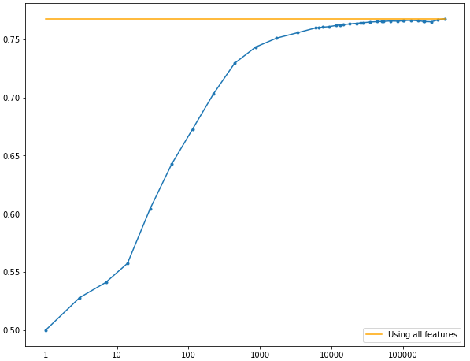
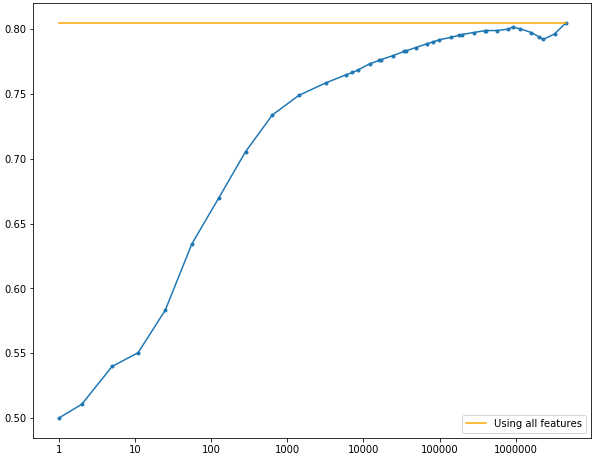
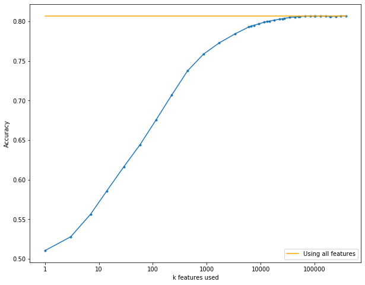

# TwitterSentimentAnalysis

## Installation setup
in order to work properly, you need to install the following libraries.

Don't know why, sometimes there are warning of retrocompatibility when installing numpy 1.17
and we had to stick to 1.16.4. But it is not always true, therefore it is probably due to tensowflow-gpu library having different dependencies.

Another incompatibility issue found is when running Keras Neural Nets on GPU or on CPU: unexplainably, the checkpoint for the neural net on the test error can either be called `val_acc` (GPU) or `validation_accuracy` (CPU), with no particural reason. Probably it is again due to the installation of different versions of `tensorflow` or `tensorflow-gpu`. 

- `conda install nltk gensim spacy`
- `pip install pyLDAvis`    Not used actually
- `pip install vaderSentiment`   Not used actually
- `pip install empath`   not used actually
- `python -m spacy download en`   
- `python -m nltk.downloader punkt`
- `python -m nltk.downloader all-corpora`
- `pip install spacy-langdetect`
- `conda install -c conda-forge textblob`
- `pip install fasttext`
- `conda install -c conda-forge tqdm`
- `conda install scikit-learn`
- `conda install -c anaconda pandas`
- `conda install -c anaconda numpy`
- `conda install scikit-learn`
- `conda install -c conda-forge tqdm`
- `conda install gensim`
- `sudo apt-get install mysql-server`   these are dependencies of pattern
- `sudo apt-get install libmysqlclient-dev`   these are dependencies of pattern
    - if you are on Mac `first install mysql server from https://dev.mysql.com/downloads/mysql/`
    - `brew install mysql`
- `pip install Pattern`
- `python -m textblob.download_corpora`
- `pip install argparse`

# Cleaning primitives
In order to clean the dataset we implemented some functions present in the file
`clean_helpers.py`. 
The cleaning methods allow us to clean the punctuation, numbers, urls, tags, stopwords,
lemmatize words, reduce the number of repeated letters down to 2 (English doesn't have any word with more than 2 repetitions of the same letter).
These primitives can be invoked using the python module `clean_data.py`,
which applies all the primitives chosen from a given list. (in order to show the list,
just type `python3 clean_data.py --help`). Additionally, we can decide to delete all words not present in the vocabulary of the Word2Vec or Glove model chosen (this is particulary useful when the model is pretrained, and not trained specifically on our dataset).

The combination of cleaning methods which gives the best results were: 
        
- `clean_new_line`
- `lowercase`
- `lemmatize` using *TextBlob* library
- `remove_stopwords` using *spacy* library
- `clean_punctuation` 
- `clean_tags`
- `remove_numbers`
- `remove_saxon_genitive`
- `more_than_double_rep`
- `remove_@`
- `remove_urls`

Nor the *Word2Vec*, nor the *GloVe* model showed a clear improvement in performance, therefore they will both produce comparable results (although *Glove* is smaller, and therefore it requires less RAM when executing).

Before running the module `clean_data.py`, be sure to have a directory called `models`, which contains both the pre-trained Glove and Word2Vec embeddings.
They can be downloaded from [1] and [2]

# Naive Bayes 
In order to try out the naive Bayes approach, type `python3 naive_bayes_template.py --help` and follow the instructions. In case you decide to test locally, a graph of accuracy for maximum length of n-grams will be constructed. This might take a while because the results are considered for values of n up to 10. If you do not test locally, a submission file will be constructed.

# Support Vector Machine
In order to try out the SVM approach, type `python3 svm_template.py --help` and follow the instructions. In case you decide to test locally, the accuracy when using an SVM will get printed. If you do not test locally, a submission file will be constructed.

# Feature selection
With feature selection one wishes to extract a subset of the features and discard the rest of them in the training process. The utility measure that we use is the \(\mathcal{\chi}^2\)-test. In order to try out this test, run `chi2test_template.py`. This will consider the test for naive Bayes for unigrams only, and for uni- and digrams only. The resulting graph for the unigrams only will be

and the resulting graph for the uni- and digrams only is

The file also considers the $\mathcal{\chi}^2$-test for SVM for unigrams only. The resulting graph will be

# Word Embedding Averaging 
One of the approaches tried is the Word Embedding averaging. It consists in embedding the sentences by averaging the word vectors of each word present in every sentence. After having embedded the sentences, a dense neural network is applied to the sentence vector, which classifies the tweets into positive and negative classes.

The pipeline for this approach is given by the following operations: 
- Clean the tweets 
- Split the dataset into train and test. (Only when testing locally).
- Train the word2vec model (if using a pretrained model, it can be skipped).
- Embed the sentences.
- Train a dense neural network to perform classification into postive and negative class.

## Clean tweets
In order to apply the cleaning primitives, just run the command
`python3 clean_data.py --help` and let you get guided by the command line instructions.

## Train and test split
Then, you can decide either to split the training data into train and test, according to whether you want to test it locally or you want to create the submission (of course, when you create the submission, you want to use the entire dataset and this part is simply skipped)

In order to divide the dataset into train and test set run

`python3 train_test_split.py --help` 

and follow the instructions. In particular, you can choose the split ratio (we used 0.8), and the output files for the pickles that will contain the dataframes with columns `sentence` and `label` (the training and the testing dataframe).
Sentences are shuffled, in order to avoid to have all positive or negative tweets fall into one of the two splits.

## Word embedding
Afterwards, you need to create and train the Word2Vec model, in order to be able to perform word embeddings. 
The word embeddings will be used when creating the sentence embeddings: in fact by averaging the word vectors of the words in every sentence, you may come up with a vector representation of the entire sentence. This is possible thanks to the Word2Vec properties of keeping semantically similar words close in the representation space.

In order to train the word2vec model, run

`python3 word2vec_model_constructor.py --help` 

and follow the instructions. You can choose the embedding size, whether to use skip-gram or cbow, the size of the window and the number of epochs.
Or, if you prefer, you can use a pretrained model (we used Google's pretrained model, obtainable here `https://drive.google.com/file/d/0B7XkCwpI5KDYNlNUTTlSS21pQmM/edit`)
When using custom models, we empirically experienced better results using 5 epochs and word vectors of size 200-300. Using cbow or skip-gram didn't affect results in practice, and nor the window size (which we eventually set to 5, as suggested by the author[1])

When deciding whether to use the pretrained model or not, you have to consider that: Google's model is certainly going to be more accurate, as it has been trained on a huge dataset (6 billions sentences), but at the same time it is not specialized for the Twitter dataset provided for the challenge. Your own model, instead, having been trained specifically on the training dataset, is going to be probably less accurate than Google's one, but you will have at least all the embeddings for the words in the vocabulary. The same applies to the Glove word embedding.

We noticed, in fact, that when using Google's model we could only manage to find the representation for about 60,000 unique words, if compared to more than 350,000 when using a custom model. The fact that Google's model has the representation for only a limited set of words may turn to be a problem, unless we consider the fact that most of the words that Google's model doesn't have are mispelled words, hashtags or words containing special characters, which may not be particulary important. Moreover, about half of the words appear only once in the entire dataset, and aren't therefore particulary informative.

## Sentence embedding
Next step consists in computing the sentence embeddings. Two approaches have been used: the first one is simply taking the average of the word vectors that are present in each sentence. This approach, which is possible to apply thanks to the Word2Vec properties of mapping semantically similar words into close vectors in the representation space, proved to work: it achieved an accuracy of 82% on the platform *AI Crowd*.

In order to compute the sentence embedding averaging the word vectors, run 

`python3 create_sentence_representation.py --help` 

and follow the instructions. In particular, you will be able to select the model that you want to use to compute the word embeddings. Moreover, a `--limit` argument can be provided during testing (it easily explodes with memory consumption, mainly when working with Google's model which by itself demands several - around 4 - GigaBytes of memory). In this way we were able to test if the primitives were correct on a smaller fraction of the dataset, before executing it on the full dataset (it may take several minutes).

A different approach for computing the sentence embedding has been used: instead of averaging the word embeddings in every sentence, we take advantage of the probability measure given by the *chi2* (chi squared). This value provides a numerical measure to judge whether the presence of a term in a sentence is dependent or independent from a certain label. We may assume, for instance, that the smile ;) will be highly dependent on the presence of the label :). And the same can be said for terms like *love*, *happy* and so on. If a word has a high *chi2* value then, it means that we should give it more *importance* when computing the average, as its presence in the sentence is more likely to be correlated to the presence of a certain label (they are not independent). This has been achieved taking the average of the word embeddings (as before), but weighted by the chi2 value of the words themselves. In contrast to expectations, this model didn't provide good results, assessing at about 77% when performing cross validation to fine tune the hyper-parameters of the classifier. 

You can create sentence embeddings weighted by the *chi2* value using the module 
`python3 create_chi2_sentence_representation.py --help` and following the instructions.

You will be asked to provide a word2vec pretrained model, a dataframe of sentences and a dataframe with the *chi2* value for all the words in our vocabulary.

You can create the chi2 score for all words in the vocabulary of the model chosen by running 

the module `python3 compute_chi2_for_words.py --help` 

It will output a dataframe, where all words are mapped to their chi2 value.

The sentence representation vectors, then, are fed into a dense neural network which tries to predict the correct labels (1, 0 for positive or negative)
according to the training labels. We used cross validation in order to fine tune the hyperparameters of the neural network,
although given the complexity and the required time to train every model for several epochs, we had to use just one train and test split.

## Need to be converted to python
You can run the classifier by running the notebook `word2vec_nn.ipynb`

# Convolutional Neural Network

A different approach has been attempted in order to perform sentence embedding, which implies the usage of a *Convolutional Neural Network*.

Even in this approach you need to represent words using word vectors. We decided to use as models both a custom one, trained on the dataset provided by us (step `python3 word2vec_model_constructor.py --help`), Google's Word2Vec model [2] and a GloVe pretrained model on a Twitter dataset [3]. All of them proved to work equally good in practice, reaching accuracy from 82% to 83%. 

The approach consists in the following: we embed sentences by representing them as a bidimensional matrix of fixed size, where all the words appearing in the sentence represent one row in the matrix, and the width of the matrix is given by the size of the word embedding chosen (200-300 in our case).

If any sentence is not long enough, which means that some rows would be left empty, then they are padded with either zero vectors or random vectors (again, both approaches didn't prove to work differently in practice, and are therefore to be considered equally good).

The size of the matrix, therefore, remains to be decided: in fact, although one dimension is fixed (the dimension of the word embedding chosen), the other one needs to be decided "arbitrarily".

# References
- [1]: https://papers.nips.cc/paper/5021-distributed-representations-of-words-and-phrases-and-their-compositionality.pdf
- [2] https://code.google.com/archive/p/word2vec/
- [3] https://nlp.stanford.edu/projects/glove/
